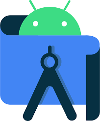
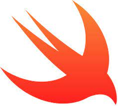

### Ruy Mesquita 👋

 

- 🔭 I’m currently working on [LetsGetChecked](https://www.letsgetchecked.ie/) as a mobile developer
- 💬 Ask me about anything [here](https://github.com/mesquitaa/mesquitaa/issues/new)

 
<b>Languages and Tools:</b>
 

<!--
**mesquitaa/mesquitaa** is a ✨ _special_ ✨ repository because its `README.md` (this file) appears on your GitHub profile.

Here are some ideas to get you started:

- 🔭 I’m currently working on ...
- 🌱 I’m currently learning ...
- 👯 I’m looking to collaborate on ...
- 🤔 I’m looking for help with ...
- 💬 Ask me about ...
- 📫 How to reach me: ...
- 😄 Pronouns: ...
- ⚡ Fun fact: ...
-->

  

 
* NOTE: Top languages does not indicate my skill level or something like that, it's a github metric of which languages I have the most code on github.
